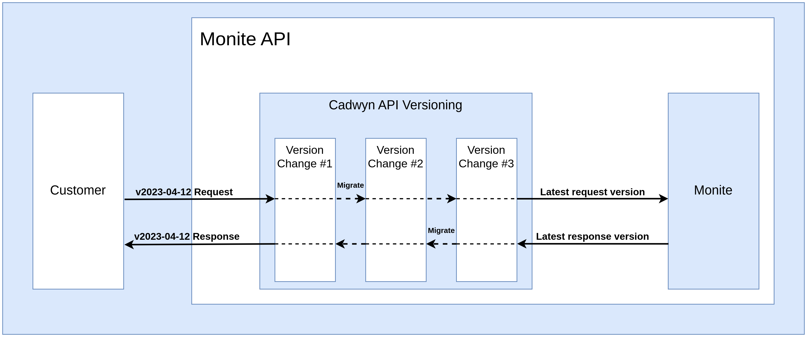

# Surviving API Versioning at Monite

## Why do we need it?

We all love to have shiny new tools but we all hate to constantly update them. This applies to anything: operating systems, apps, APIs, linux packages. It is painful when you write code for interfacing with something and then the code breaks upon update. It is doubly painful when the update was not even initiated by you.

In web API development, you are constantly at risk of breaking your users' code with every new update. If your main product is an API, then these updates will be terrifying every time. Monite is an API-first company: our products are our API and our white-label SDK and we take great care of keeping our API stable and easy to use. So the problem of breaking changes is near the top of our priority list.

A common solution is to issue deprecation warnings to your clients and to release breaking changes rarely. Suddenly, your releases can now take months and some features have to stay hidden or even unmerged until each next release. This slows down your development and forces your users to update their integration every few months. If you make releases faster, your users are going to have to update their integration too often. If you lengthen the time between releases, you will move slower as a company. The more inconvenient you make it for users -- the more convenient it is going to be for you, and vice versa. This is certainly not an optimal scenario. We wanted to move at our own pace without breaking anything for existing clients which would we impossible with a regular deprecation approach. This is why we picked an alternative solution: **API versioning**.

It is quite a simple idea: release any breaking changes at any time but hide them under a new API version. It grants you the best of both worlds: The users will not have their integrations routinely broken and you will be able to move at any speed you like. The users will migrate whenever they want -- free of any pressure. Considering the simplicity of the idea, it feels perfect for any company. That is what you would expect to read in a typical engineering blog. Sadly, it is not so simple.

## Beware of the price

API versioning is hard, very hard. Its illusory simplicity quickly fades away once you begin implementing it. Sadly, the internet never really warns you as there are surprisignly few resources on the topic. The absolute majority of resources argue about where to put the API version but only a few scarce articles attempt to answer: "How do we **implement** versioning?". The most common ones are:

* putting different versions of the same web application into separate kubernetes namespaces
* copying single routes that have changed between versions
* using sophisticated version-generation frameworks

Kubernetes namespaces can get really expensive and hard to support, copying single routes does not scale really well to large changes, and sophisticated frameworks are expensive to build. Even if you try to pick the cheapest one, the burden of versioning will catch up soon. At first, it will feel simple: add another schema here, another branch in business logic there, and duplicate a few routes at the end. But given enough versions your business logic will quickly become unmanageable, many of your developers will mistake application versions and API versions, and will start versioning the data within your database, and your application will become unmaintainable.

You might hope that you will never have more than two or three API versions at the same time; that you will be able to delete old versions every few months. It is true if you only support a small number of internal consumers. But clients outside of your organization will not enjoy the experience of being forced to upgrade every few months.

API versioning can quickly become one of the most expensive parts of your infrastructure so it is critical to do dilligent research beforehand. If you only support internal consumers, then GraphQL might be a better tool as it almost completely nullifies most issues with API versioning. If you are a startup, it would be wise to postpone API versioning until the later stages of your development when you have resources to do it right. Until then, deprecations and [additive change strategy](https://youtu.be/y6wXRMDtZd8) might suffice. Your API will not always look great but at least you will save a great deal of money by avoiding explicit versioning.

## But how to implement it?

### Our path towards the perfect versioning

After a few trials and many errors we were at the crossroads: our prior versioning approaches that we mentioned above were too expensive to maintain. As a result of our struggles, I devised the following list of requirements that would be required of a perfect versioning framework:

1. "*Maintaining a large number of versions is easy*" to make sure that versioning does not slow down our feature development (TODO: Add a note about layers and duplication)
2. "*Deleting old versions is easy*" to make sure that we can clean up our code base without efforts
3. "*Creating new versions is not too easy*" to make sure that our developers are still incentivized to try to solve problems without versions
4. "*Maintaining a changelog between versions is easy*" to make sure that both we and our clients can always be sure about the real differences between versions

Sadly, there were little to no alternatives to our existing approaches. This is when a crazy idea came to my mind: what if we try and build something sophisticated, something perfect for the job -- something like [Stripe's API versioning](https://stripe.com/blog/api-versioning). As a result, now we have [Cadwyn](https://github.com/zmievsa/cadwyn): a production-ready open-source API versioning framework that not only implements Stripe's approach but significantly builds on top of it. We will be talking about its Fastapi and Pydantic implementation but its approach is completely language and framework agnostic.

### How Cadwyn works

#### Version Changes

The problem of all other versioning approaches is that we are duplicating too much. Why would we duplicate the entire route, controller, or even application when only a tiny part of our contract got broken? With Cadwyn, whenever API maintainers need to create a new version, they apply the breaking changes to their latest schemas, models, and business logic. Then they create a declarative version change -- a class that encapsulates all differences between the new version and a prior version. For example, let's say that previously our clients could create a user with an address but now we would like to allow them to specify multiple addresses instead of a single one. The version change would look like this:

```python
class ChangeUserAddressToAList(VersionChange):
    description = (
        "Change `User.address` to `User.addresses` to allow "
        "users to have multiple addresses"
    )
    instructions_to_migrate_to_previous_version = (
        schema(User).field("addresses").didnt_exist,
        schema(User).field("address").existed_as(type=str),
    )

    @convert_request_to_next_version_for(UserCreateRequest)
    def change_address_to_multiple_items(request):
        request.body["addresses"] = [request.body.pop("address")]

    @convert_response_to_previous_version_for(UserResource)
    def change_addresses_to_single_item(response):
        response.body["address"] = response.body.pop("addresses")[0]
```

`instructions_to_migrate_to_previous_version` are used by Cadwyn to generate code for older API versions of schemas and the two converter functions are the trick that allows us to maintain as many versions as we would like. The process looks like the following:

1. Cadwyn converts all user requests from older API versions to the latest API version by using `change_address_to_multiple_items` converter, and pipes them to our business logic
2. Business logic, its API responses, and database models are always tailored to the latest API version
3. After business logic produced the response, Cadwyn converts it to the older API version that the client requester is currently on by using `change_addresses_to_single_item` converter.

After our API maintainers have created the version change, they need to add it to our VersionBundle to tell Cadwyn that this VersionChange will be included in some version and then use Cadwyn's code generation abilities to regenerate all schemas:

```python
VersionBundle(
    Version(
        date(2023, 4, 27),
        ChangeUserAddressToAList
    ),
    Version(
        date(2023, 4, 12),
        CollapseUserAvatarInfoIntoAnID,
        MakeUserSurnameRequired,
    ),
    Version(date(2023, 3, 15)),
)
```

That's it: we have added a breaking change but our business logic only handles a single version -- latest. Even after we add dozens of API versions, our business logic will still be free from versioning logic, constant renamings, if's and data converters.

#### Version Chaining

Because version changes are dependent on the public interface of the version and are independent of the implementation details, they are effectively immutable so they are much easier to maintain than the same logic in our controllers. They are also applied one after another -- forming a chain of changes between versions that can migrate any request to the latest version and any response to any other version.



#### Side effects

API contracts are much more complex than just schemas and fields. It consists of the endpoints, status codes, errors, error **messages**, and even business logic behavior. Cadwyn uses the same DSL we described above to handle endpoints and status codes but errors and business logic behavior is a different story: it is impossible to describe using a DSL, it needs to be embedded into business logic. This makes such version changes much more expensive to maintain than all others because they affect business logic. We call this property a "side effect" and it is recommended to avoid them at all costs because of their cost.

All version changes that want to modify business logic will need to be marked as having side effects. It will serve as a way to know which version changes are "bad":

```python
class RequireCompanyToBeAttachedForPayment(VersionChangeWithSideEffects):
    description = (
        "User must now have a company_id for their account "
        "if they want to make payments"
    )
```

It will also allow API maintainers to check that the client request uses an API version that includes this side effect:

```python
RequireCompanyToBeAttachedForPayment.is_applied
```

## No silver bullets

Cadwyn has many benefits: It greatly reduces the burden on our developers and can be integrated into our infrastructure to automatically generate the changelog and improve our API docs. However, the burden of versioning still exists and even a sophisticated framework is not a silver bullet. We do our best to only use API versioning when absolutely necessary. We also try to make our API correct on the first try by having a special "API Council" within Monite. All significant API changes are reviewed there by our best developers, testers, and tech writers before any implementation gets moving.

## Special thanks

To [Brandur Leach](https://twitter.com/brandur) for his API versioning article at Stripe and for the help he extended to me when I implemented API versioning at Monite: Cadwyn would not be possible without his help.
